# 🧠 25 Retrieval-Augmented Generation (RAG) Architectures

Retrieval-Augmented Generation (RAG) architectures bridge the gap between generating responses and retrieving relevant information. This guide covers **25 RAG architectures**, their purpose, usage, and real-world examples.

---

## 1️⃣ Corrective RAG: Real-Time Fact-Checker

**Description:** Checks generated responses against trusted sources before delivering. ✅
**Usage Context:** High-stakes fields like healthcare and finance.
**Example:** A healthcare chatbot verifies medication dosages before responding.

**Flow Diagram (Mermaid):**

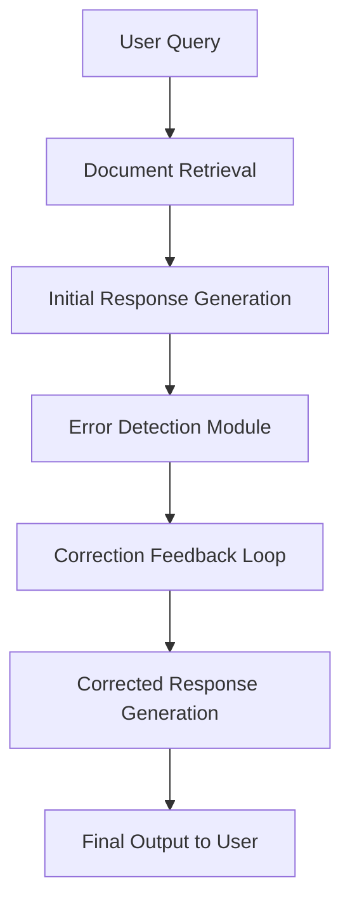

---

## 2️⃣ Speculative RAG: A Step Ahead of You

**Description:** Anticipates user needs and pre-fetches information. 🔮
**Usage Context:** Time-sensitive applications like news apps or customer service.
**Example:** Pre-fetches trending articles on “climate change” before a user finishes typing.

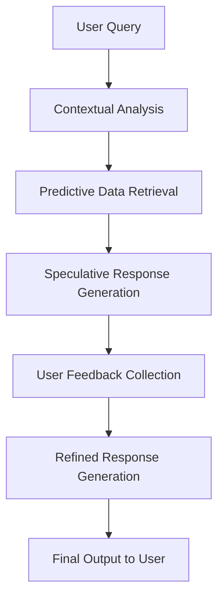

---

## 3️⃣ Agenetic RAG: The Self-Learning Assistant

**Description:** Learns from interactions to improve future responses. 🌱
**Usage Context:** Personalized recommendation systems.
**Example:** Fashion app tailors suggestions based on user preferences.

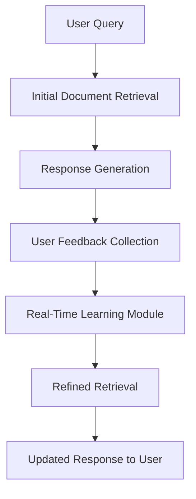

---

## 4️⃣ Self-RAG: The Self-Improving Guide

**Description:** Continuously enhances accuracy without external input. ⚙️
**Usage Context:** Financial analysis, real-time updates.
**Example:** Financial app refines stock retrieval methods based on market changes.

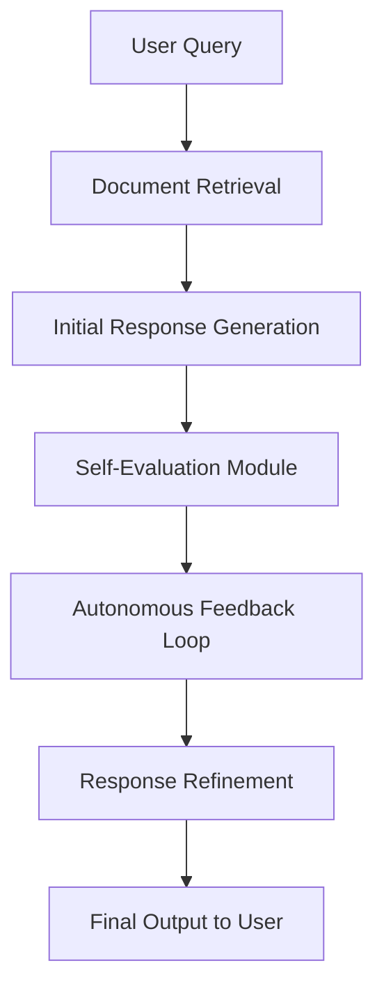

---

## 5️⃣ Adaptive RAG: The Chameleon of Retrieval

**Description:** Adjusts dynamically to changes in user context. 🦎
**Usage Context:** Platforms with rapidly shifting user needs, e.g., ticketing apps.
**Example:** Event app recommends trending events in real-time.

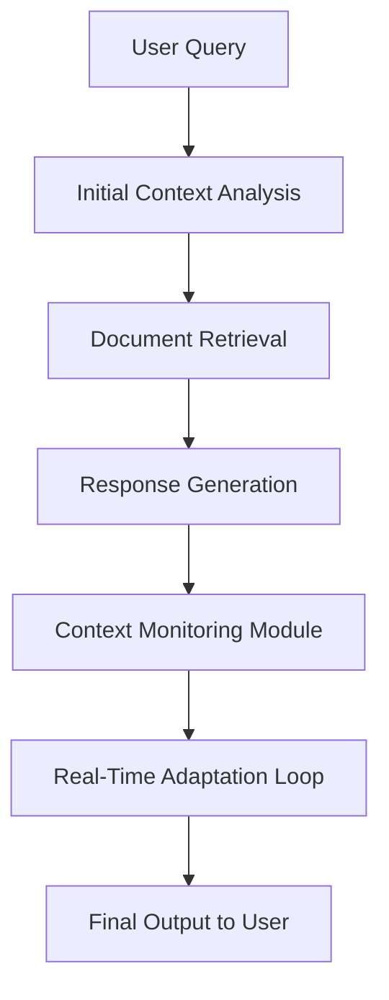

---

## 6️⃣ Refeed Retrieval Feedback RAG: The Self-Correcting Learner

**Description:** Learns continuously from user feedback. 🔁
**Usage Context:** Customer service chatbots.
**Example:** Telecom bot adjusts its knowledge base based on frequent corrections.

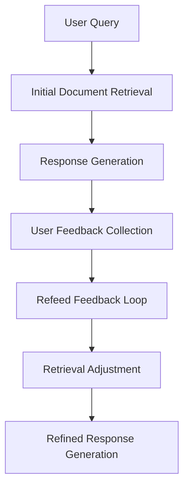

---

## 7️⃣ Realm RAG: The Knowledgeable Assistant

**Description:** Leverages LLMs to retrieve context-specific information. 📚
**Usage Context:** Legal and technical research.
**Example:** Law firm retrieves relevant legal precedents efficiently.

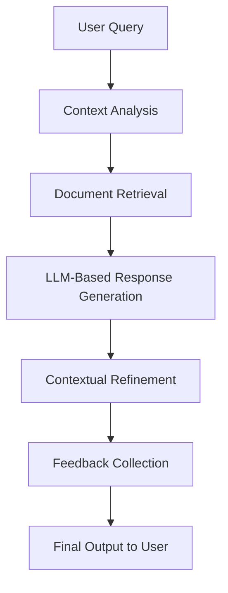

---

## 8️⃣ Raptor RAG: The Organized Problem Solver

**Description:** Hierarchical retrieval for precise navigation. 🌳
**Usage Context:** Medical diagnoses, product hierarchies.
**Example:** Hospital categorizes symptoms and retrieves relevant diagnoses.

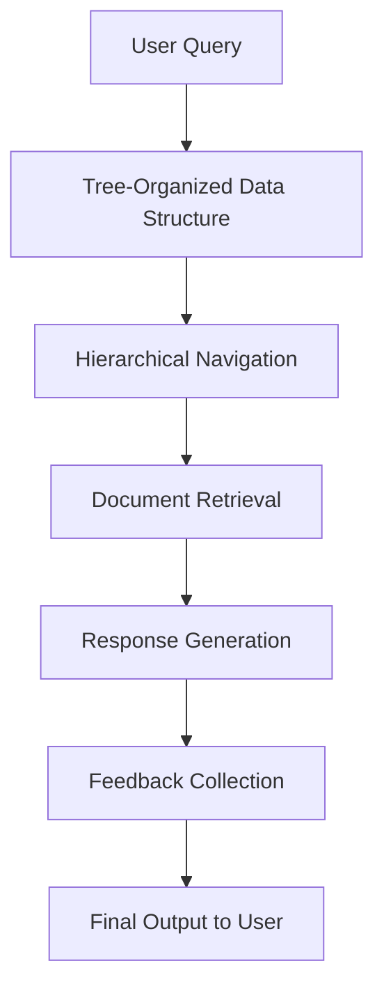

---

## 9️⃣ Replug RAG: The Data Connector

**Description:** Connects to external databases seamlessly. 🔌
**Usage Context:** Financial apps, weather updates.
**Example:** Pulls live stock prices from market databases.

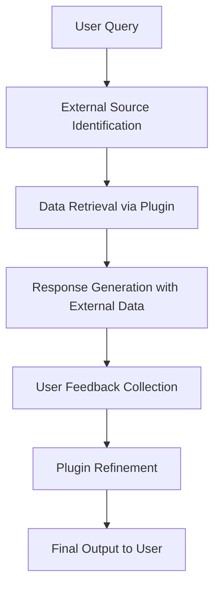

---

## 10️⃣ Memo RAG: The Memory Keeper

**Description:** Remembers past interactions to maintain continuity. 🧾
**Usage Context:** Tutoring platforms, customer service.
**Example:** Chatbot recalls previous issues to continue the conversation.

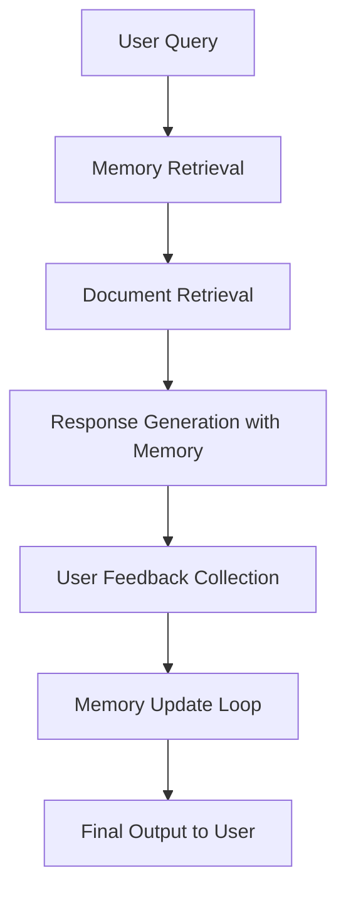

---

## 11️⃣ Attention-Based RAG: The Focused Analyzer

**Description:** Focuses on key query elements. 🎯
**Usage Context:** Academic or research platforms.
**Example:** Filters research results for “AI in healthcare.”

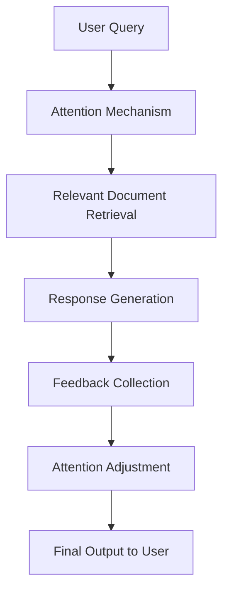

---

## 12️⃣ RETRO RAG: The Contextual Historian

**Description:** Uses historical data for contextual responses. 🕰️
**Usage Context:** Corporate knowledge management.
**Example:** Recall previous project decisions to inform new team members.

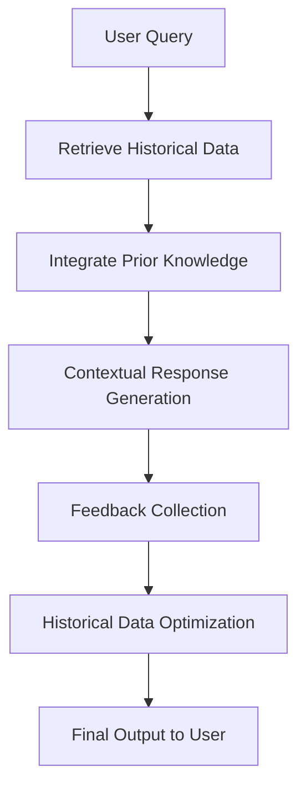

---

## 13️⃣ Auto RAG: The Hands-Free Retriever

**Description:** Fully automated retrieval with minimal supervision. 🤖
**Usage Context:** News aggregators, stock apps.
**Example:** Pulls top news stories automatically each morning.

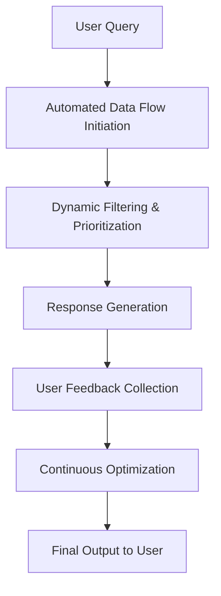

---

## 14️⃣ Cost-Constrained RAG: The Budget-Conscious Retriever

**Description:** Optimizes retrieval within budget limits. 💰
**Usage Context:** Non-profits, cost-sensitive operations.
**Example:** Selects only affordable sources to retrieve data.

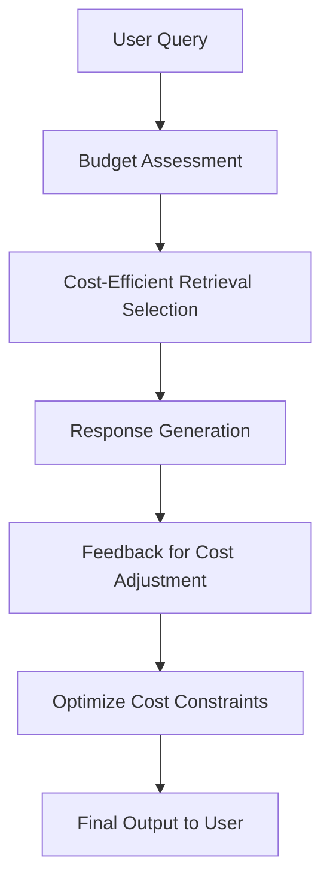

---

## 15️⃣ ECO RAG: The Green Retriever

**Description:** Minimizes energy usage during retrieval. 🌿
**Usage Context:** Green tech, sustainable companies.
**Example:** Optimizes sensor data retrieval while reducing energy consumption.

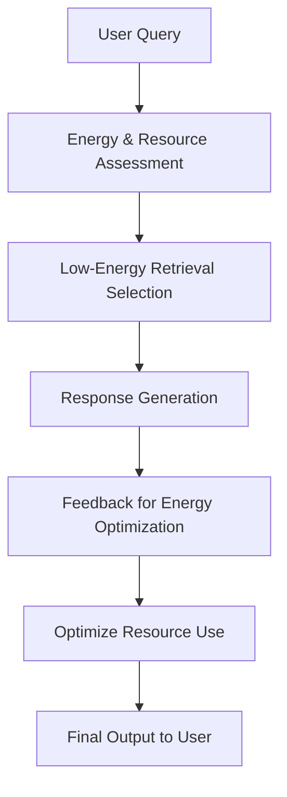

---

## 16️⃣ Rule-Based RAG: The Compliant Guide

**Description:** Ensures responses comply with rules or regulations. 📜
**Usage Context:** Finance, healthcare.
**Example:** Financial advice complies with legal standards.

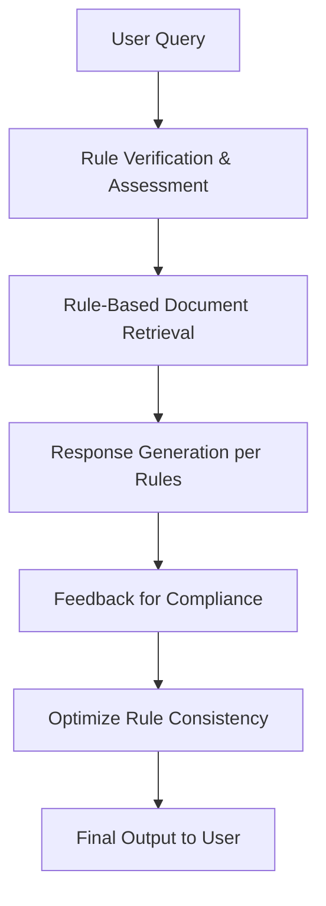

---

## 17️⃣ Conversational RAG: The Engaging Communicator

**Description:** Enables natural, interactive dialogue. 💬
**Usage Context:** Chatbots, virtual assistants.
**Example:** Retail chatbot engages seamlessly with customers.

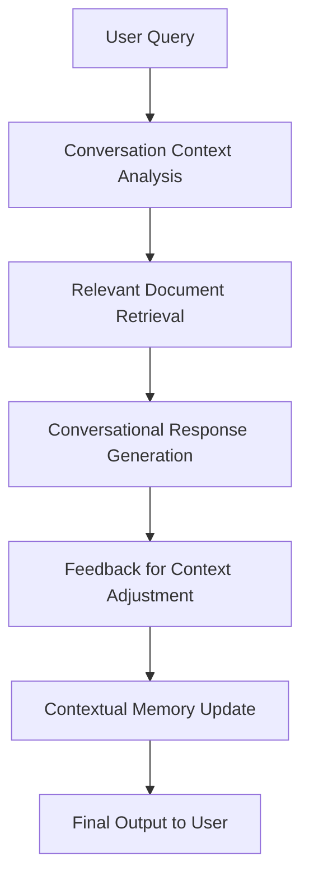

---

## 18️⃣ Iterative RAG: The Refining Expert

**Description:** Refines responses through multiple iterations. 🔄
**Usage Context:** Technical support, troubleshooting.
**Example:** Tech support bot improves solution based on ongoing feedback.

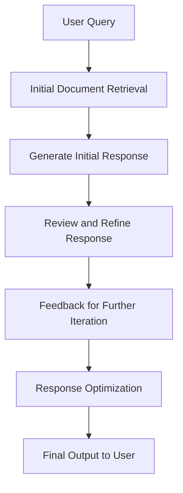

---

## 19️⃣ HybridAI RAG: The Multi-Talented Retriever

**Description:** Integrates multiple ML models for versatile responses. 🔀
**Usage Context:** Predictive maintenance, financial modeling.
**Example:** Predicts equipment failure by combining multiple sensor data models.

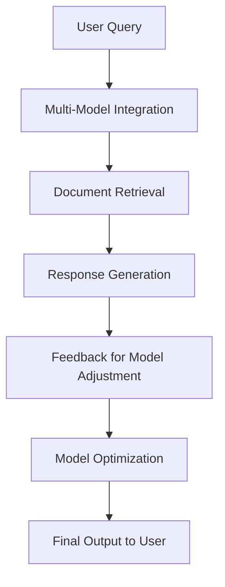

---

## 20️⃣ Generative AI RAG: The Creative Thinker

**Description:** Combines retrieval with creative content generation. 🎨
**Usage Context:** Marketing, content creation.
**Example:** Generates social media posts combining brand history with new ideas.

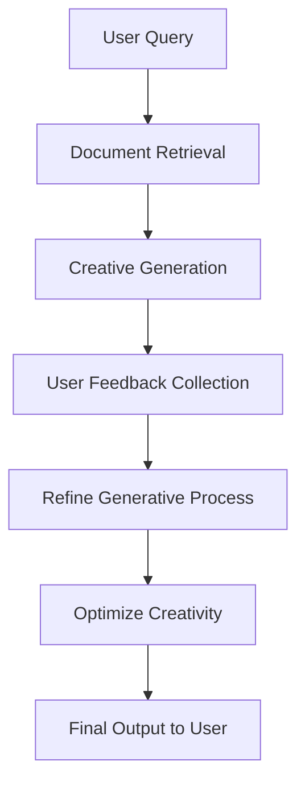

---

## 21️⃣ XAI (Explainable AI) RAG: The Transparent Advisor

**Description:** Provides explainable reasoning for responses. 🔍
**Usage Context:** Healthcare, legal, regulated sectors.
**Example:** Suggests treatments with clear explanations in healthcare.

```mermaid
flowchart TD
    A[User Query] --> B[Document Retrieval]
    B --> C[Transparent Response Generation]
    C --> D[Explainability Layer]
    D --> E[Feedback on Clarity]
    E --> F[Refine Explainability]
    F --> G[Final Output to User]
```

---

## 22️⃣ Context Cache in LLM RAG: The Memory Bank

**Description:** Caches previous interactions for continuity. 🗂️
**Usage Context:** Educational tools, tutoring platforms.
**Example:** Virtual tutor recalls past lessons to maintain coherent responses.

```mermaid
flowchart TD
    A[User Query] --> B[Retrieve Context Cache]
    B --> C[Contextual Response Generation]
    C --> D[User Feedback Collection]
    D --> E[Update Context Cache]
    E --> F[Optimize Context Consistency]
    F --> G[Final Output to User]
```

---

## 23️⃣ Grokking RAG: The Intuitive Learner

**Description:** Understands concepts deeply for nuanced insights. 🧩
**Usage Context:** Scientific or technical research.
**Example:** Research assistant synthesizes complex chemistry topics into understandable insights.

```mermaid
flowchart TD
    A[User Query] --> B[Deep Document Retrieval]
    B --> C[Intuitive Response Generation]
    C --> D[User Feedback Collection]
    D --> E[Refine Concept Understanding]
    E --> F[Optimize Grokking Ability]
    F --> G[Final Output to User]
```

---

## 24️⃣ Replug Retrieval Feedback: The Adjusting Connector

**Description:** Connects to external data sources and improves via feedback. 🔗
**Usage Context:** Real-time data-heavy fields.
**Example:** Market insights tool adjusts data source connections for accuracy.

```mermaid
flowchart TD
    A[User Query] --> B[External Data Source Identification]
    B --> C[Retrieve External Data]
    C --> D[User Feedback Collection]
    D --> E[Refine Data Source Selection]
    E --> F[Optimize External Retrieval]
    F --> G[Final Output to User]
```

---

## 25️⃣ Attention Unet RAG: The Detailed Mapper

**Description:** Uses attention mechanisms for detailed segmentation. 🖼️
**Usage Context:** Radiology, image analysis.
**Example:** Segments MRI images for precise tissue analysis.

```mermaid
flowchart TD
    A[User Query] --> B[Image Data Retrieval]
    B --> C[Attention-Based Segmentation]
    C --> D[Detailed Response Generation]
    D --> E[User Feedback Collection]
    E --> F[Optimize Segmentation]
    F --> G[Final Output to User]
```

---

## ✅ Conclusion

These 25 RAG architectures demonstrate the versatility of **Retrieval-Augmented Generation**. Selecting the appropriate architecture ensures:

* Accurate and reliable responses ✅
* Contextually rich outputs 📖
* User-friendly and interactive experiences 🤝
* Regulatory compliance and transparency 🛡️

