# 🧠 25 RAG Architectures – Retrieval-Augmented Generation Guide

Retrieval-Augmented Generation (RAG) combines **information retrieval** with **AI response generation**. This guide explores 25 RAG architectures, their purpose, usage contexts, and real-world examples.

---

## Table of Contents

1. [Corrective RAG](#1-corrective-rag-real-time-fact-checker)
2. [Speculative RAG](#2-speculative-rag-a-step-ahead-of-you)
3. [Agenetic RAG](#3-agenetic-rag-the-self-learning-assistant)
4. [Self-RAG](#4-self-rag-the-self-improving-guide)
5. [Adaptive RAG](#5-adaptive-rag-the-chameleon-of-retrieval)
6. [Refeed Retrieval Feedback RAG](#6-refeed-retrieval-feedback-rag-the-self-correcting-learner)
7. [Realm RAG](#7-realm-rag-the-knowledgeable-assistant)
8. [Raptor RAG](#8-raptor-rag-the-organized-problem-solver)
9. [Replug RAG](#9-replug-rag-the-data-connector)
10. [Memo RAG](#10-memo-rag-the-memory-keeper)
11. [Attention-Based RAG](#11-attention-based-rag-the-focused-analyzer)
12. [RETRO RAG](#12-retro-rag-the-contextual-historian)
13. [Auto RAG](#13-auto-rag-the-hands-free-retriever)
14. [Cost-Constrained RAG](#14-cost-constrained-rag-the-budget-conscious-retriever)
15. [ECO RAG](#15-eco-rag-the-green-retriever)
16. [Rule-Based RAG](#16-rule-based-rag-the-compliant-guide)
17. [Conversational RAG](#17-conversational-rag-the-engaging-communicator)
18. [Iterative RAG](#18-iterative-rag-the-refining-expert)
19. [HybridAI RAG](#19-hybridai-rag-the-multi-talented-retriever)
20. [Generative AI RAG](#20-generative-ai-rag-the-creative-thinker)
21. [XAI RAG](#21-xai-rag-the-transparent-advisor)
22. [Context Cache in LLM RAG](#22-context-cache-in-llm-rag-the-memory-bank)
23. [Grokking RAG](#23-grokking-rag-the-intuitive-learner)
24. [Replug Retrieval Feedback](#24-replug-retrieval-feedback-the-adjusting-connector)
25. [Attention Unet RAG](#25-attention-unet-rag-the-detailed-mapper)

---

## 1️⃣ Corrective RAG – Real-Time Fact-Checker ✅

**Purpose:** Checks responses against trusted sources before delivering.
**Use Case:** Healthcare, finance.
**Example:** Verifies medication dosages before responding.

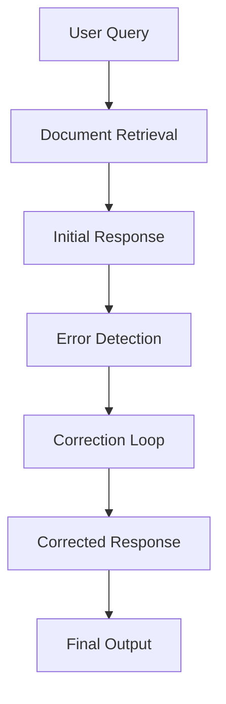

---

## 2️⃣ Speculative RAG – A Step Ahead of You 🔮

**Purpose:** Anticipates user needs; pre-fetches data.
**Use Case:** News, customer service.
**Example:** Pre-fetch trending articles for “climate change”.

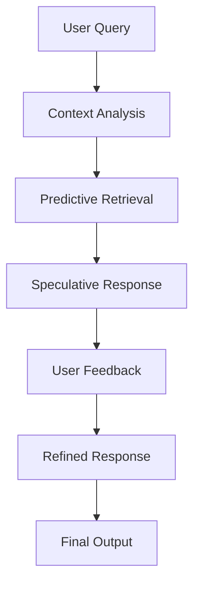

---

## 3️⃣ Agenetic RAG – The Self-Learning Assistant 🌱

**Purpose:** Learns from user interactions to improve personalization.
**Use Case:** E-commerce recommendations, streaming.
**Example:** Fashion app tailors recommendations to user style.

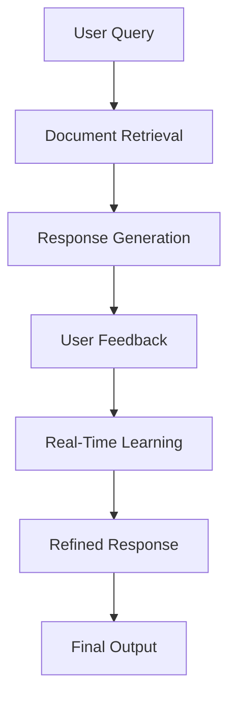

---

## 4️⃣ Self-RAG – The Self-Improving Guide ⚙️

**Purpose:** Continuously improves its retrieval accuracy.
**Use Case:** Financial apps with live data.
**Example:** Adapts stock data retrieval based on market changes.

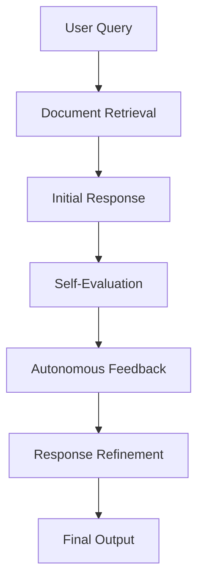

---

## 5️⃣ Adaptive RAG – The Chameleon of Retrieval 🦎

**Purpose:** Adjusts to changing contexts in real-time.
**Use Case:** Event ticketing, trending platforms.
**Example:** Recommends popular events as demand changes.

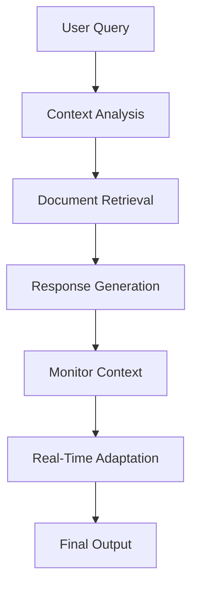

---

## 6️⃣ Refeed Retrieval Feedback RAG – The Self-Correcting Learner 🔁

**Purpose:** Learns continuously from user corrections.
**Use Case:** Customer service bots.
**Example:** Telecom bot improves responses via feedback loops.

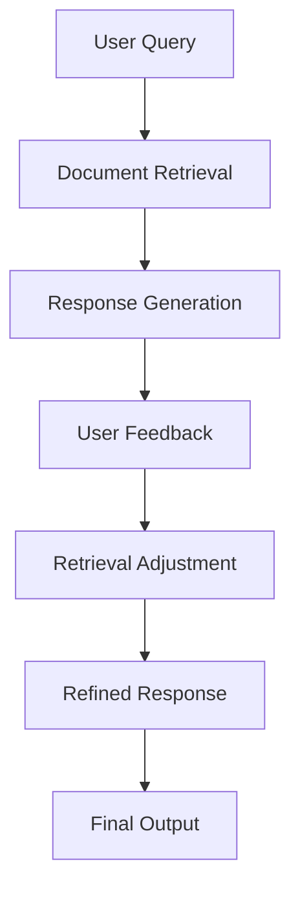

---

## 7️⃣ Realm RAG – The Knowledgeable Assistant 📚

**Purpose:** LLM-powered, context-specific retrieval.
**Use Case:** Legal, technical research.
**Example:** Retrieves case-specific legal precedents.

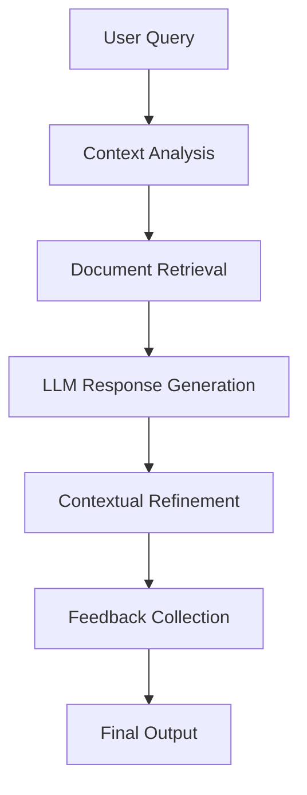

---

## 8️⃣ Raptor RAG – The Organized Problem Solver 🌳

**Purpose:** Tree-based hierarchical retrieval for precise navigation.
**Use Case:** Medical diagnosis, product hierarchies.
**Example:** Categorizes symptoms to suggest diagnoses.

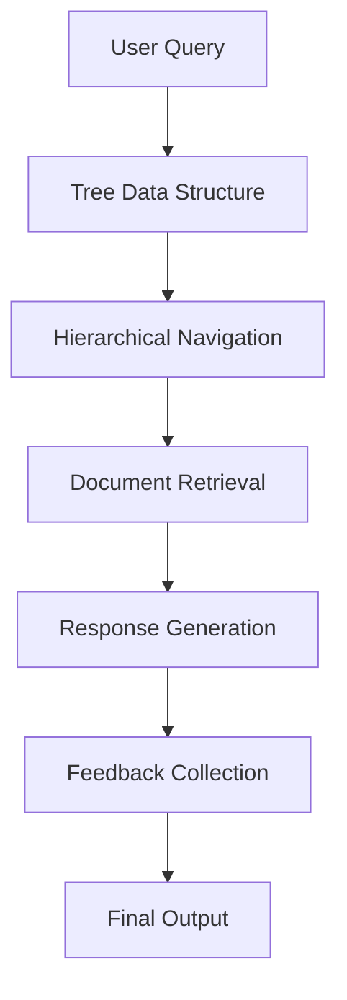

---

## 9️⃣ Replug RAG – The Data Connector 🔌

**Purpose:** Pulls information from external sources seamlessly.
**Use Case:** Financial apps, live data platforms.
**Example:** Retrieves live stock prices from databases.

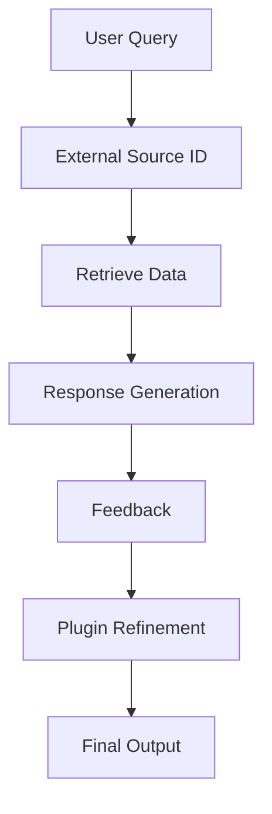

---

## 10️⃣ Memo RAG – The Memory Keeper 🧾

**Purpose:** Remembers past interactions for context continuity.
**Use Case:** Tutoring platforms, customer support.
**Example:** Chatbot recalls previous issues for seamless conversations.

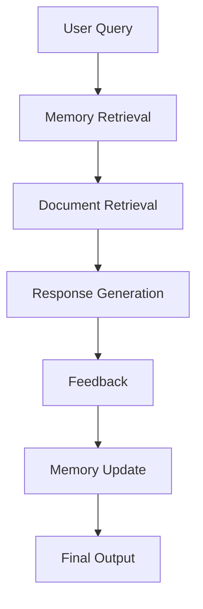

---

## 11️⃣ Attention-Based RAG – The Focused Analyzer 🎯

**Purpose:** Focuses on essential query elements.
**Use Case:** Academic or research platforms.
**Example:** Filters research results for “AI in healthcare”.

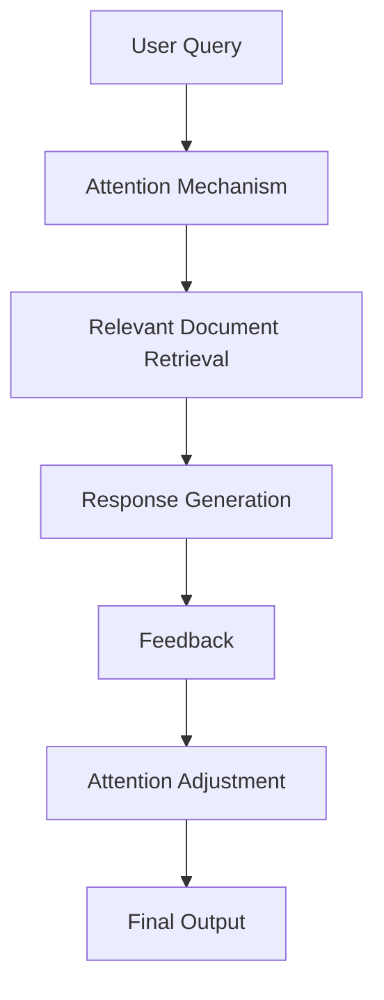

---

## 12️⃣ RETRO RAG – The Contextual Historian 🕰️

**Purpose:** Uses historical data for context-aware responses.
**Use Case:** Corporate knowledge management.
**Example:** Recalling past project decisions for new team members.

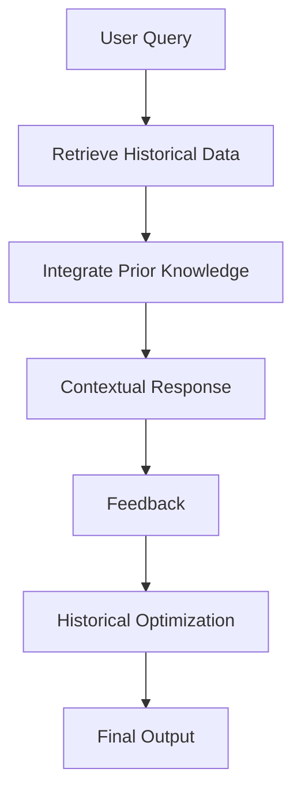

---

## 13️⃣ Auto RAG – The Hands-Free Retriever 🤖

**Purpose:** Fully automated retrieval system.
**Use Case:** News apps, dynamic data platforms.
**Example:** Automatically pulls top news stories each morning.

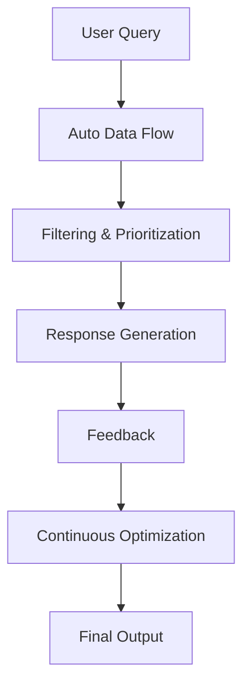

---

## 14️⃣ Cost-Constrained RAG – The Budget-Conscious Retriever 💰

**Purpose:** Optimizes retrieval within a cost budget.
**Use Case:** Non-profits, budget-sensitive projects.
**Example:** Chooses affordable data sources.

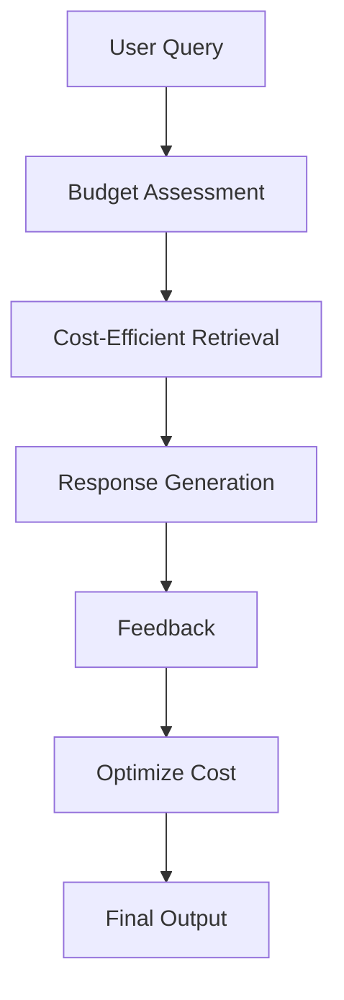

---

## 15️⃣ ECO RAG – The Green Retriever 🌿

**Purpose:** Energy-efficient retrieval system.
**Use Case:** Sustainable tech applications.
**Example:** Optimizes sensor retrieval with minimal energy.

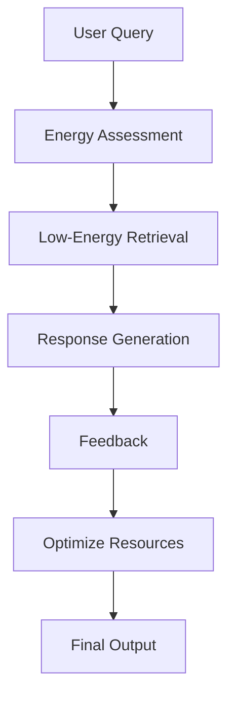

---

## 16️⃣ Rule-Based RAG – The Compliant Guide 📜

**Purpose:** Ensures responses follow strict rules or regulations.
**Use Case:** Finance, healthcare, regulated industries.
**Example:** Financial advisory system provides legally compliant recommendations.

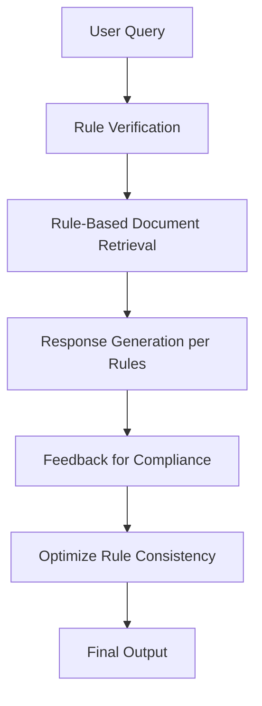

---

## 17️⃣ Conversational RAG – The Engaging Communicator 💬

**Purpose:** Enables natural, interactive dialogues with users.
**Use Case:** Retail chatbots, virtual assistants.
**Example:** Chatbot adapts to conversation flow and prior interactions.

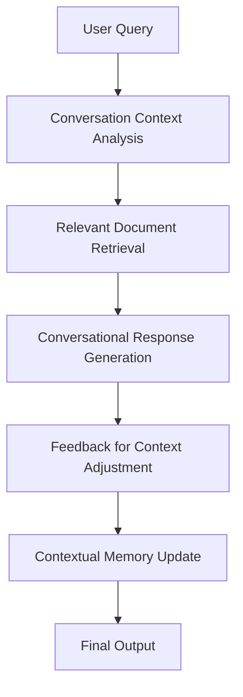

---

## 18️⃣ Iterative RAG – The Refining Expert 🔄

**Purpose:** Refines responses over multiple iterations.
**Use Case:** Technical support, troubleshooting.
**Example:** Tech support bot improves solutions through continuous feedback.

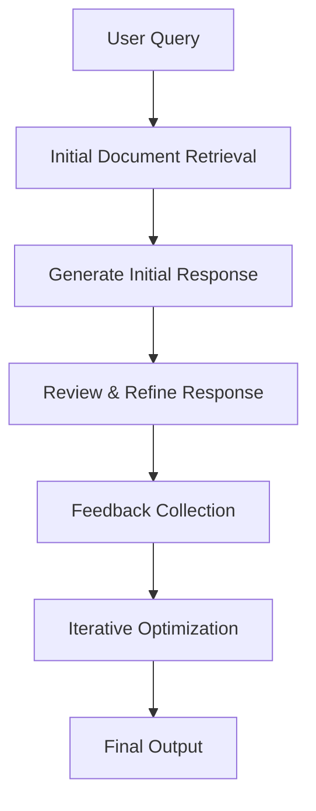

---

## 19️⃣ HybridAI RAG – The Multi-Talented Retriever 🔀

**Purpose:** Combines multiple ML models for versatile responses.
**Use Case:** Predictive maintenance, complex financial modeling.
**Example:** Predicts equipment failure using sensor data and logs.

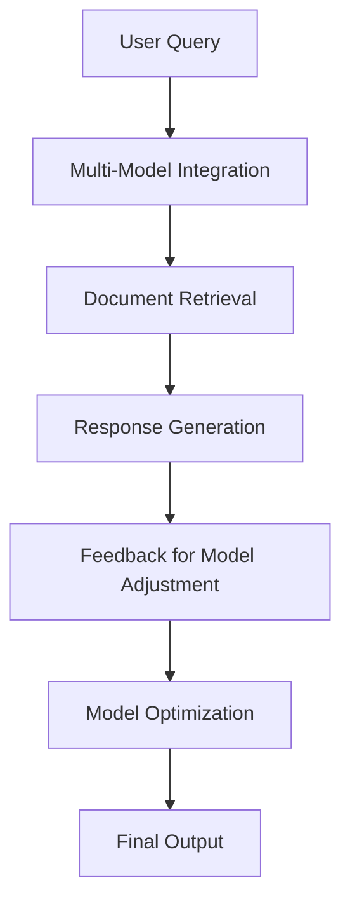

---

## 20️⃣ Generative AI RAG – The Creative Thinker 🎨

**Purpose:** Generates new, creative content from retrieved information.
**Use Case:** Marketing, brand content creation.
**Example:** Produces social media posts by combining past brand messages with new ideas.

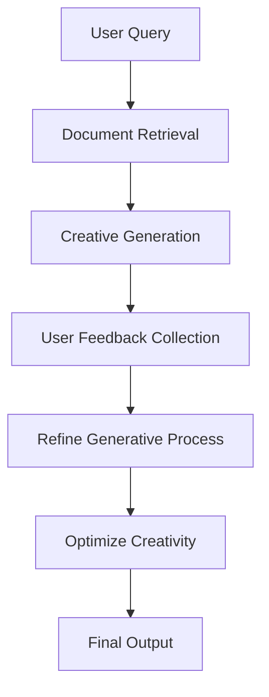

---

## 21️⃣ XAI RAG – The Transparent Advisor 🔍

**Purpose:** Ensures transparency and explainability in responses.
**Use Case:** Healthcare, legal, and regulated industries.
**Example:** Explains recommended treatments to doctors, including reasoning.

```mermaid
flowchart TD
    A[User Query] --> B[Document Retrieval]
    B --> C[Transparent Response Generation]
    C --> D[Explainability Layer]
    D --> E[Feedback on Clarity]
    E --> F[Refine Explainability]
    F --> G[Final Output]
```

---

## 22️⃣ Context Cache in LLM RAG – The Memory Bank 🗂️

**Purpose:** Maintains context from previous interactions for continuity.
**Use Case:** Educational platforms, virtual tutoring.
**Example:** Virtual tutor recalls previous lessons to provide coherent follow-up answers.

```mermaid
flowchart TD
    A[User Query] --> B[Retrieve Context Cache]
    B --> C[Contextual Response Generation]
    C --> D[User Feedback Collection]
    D --> E[Update Context Cache]
    E --> F[Optimize Context Consistency]
    F --> G[Final Output]
```

---

## 23️⃣ Grokking RAG – The Intuitive Learner 🧩

**Purpose:** Understands complex concepts deeply for nuanced insights.
**Use Case:** Scientific research, technical analysis.
**Example:** Research assistant synthesizes advanced chemistry topics into understandable insights.

```mermaid
flowchart TD
    A[User Query] --> B[Deep Document Retrieval]
    B --> C[Intuitive Response Generation]
    C --> D[Feedback Collection]
    D --> E[Refine Concept Understanding]
    E --> F[Optimize Grokking Ability]
    F --> G[Final Output]
```

---

## 24️⃣ Replug Retrieval Feedback – The Adjusting Connector 🔗

**Purpose:** Connects to external sources and refines retrieval with feedback.
**Use Case:** Data-heavy fields with real-time updates.
**Example:** Market insights tool adjusts data source connections for accuracy.

```mermaid
flowchart TD
    A[User Query] --> B[External Source Identification]
    B --> C[Retrieve External Data]
    C --> D[User Feedback Collection]
    D --> E[Refine Data Source Selection]
    E --> F[Optimize External Retrieval]
    F --> G[Final Output]
```

---

## 25️⃣ Attention Unet RAG – The Detailed Mapper 🖼️

**Purpose:** Uses attention mechanisms for precise segmentation.
**Use Case:** Medical imaging, radiology.
**Example:** Segments MRI images for accurate tissue analysis.

```mermaid
flowchart TD
    A[User Query] --> B[Image Data Retrieval]
    B --> C[Attention-Based Segmentation]
    C --> D[Detailed Response Generation]
    D --> E[User Feedback Collection]
    E --> F[Optimize Segmentation]
    F --> G[Final Output]
```

---

## ✅ Conclusion

These **25 RAG architectures** illustrate the versatility of **Retrieval-Augmented Generation**:

* ✅ Accurate & reliable responses
* 📖 Contextually rich outputs
* 🤝 User-friendly interactions
* 🛡️ Regulatory compliance and transparency

Choosing the right RAG type ensures your system is **smart, adaptive, and effective**.

---
